## Este projeto cria uma API para predizer quantidade de casos de dengue no futuro por semanas.
A API recebe os dados no seguinte formato Json:

    {
	    "dengue": 6,
	    "dengue_sma7": 6,
	    "acumulado_dengue_21": 6,
	    "acumulado": 6,
	    "populacao": 2357193,
	    "densidade_dem": 7545,
	    "precipitacao_sma7": 0,
	    "umidade_sma7": 71.1,
	    "vento_vel_sma7": 4
    }

Dicionário das variáveis:

1 dengue => Infectados dengue
2 dengue_sma7 => Infectados de dengue, média móvel de 7 dias
3 acumulado_dengue_21 => Infectados dengue acumulado 21 dias
4 acumulado => Acumulado de casos de dengue
5 populacao => População
6 densidade_dem => Densidade demográfica
7 precipitacao_sma7 => Média móvel simples da precipitação de chuva
8 umidade_sma7 => Média móvel simples da umidade relativa do ar
9 vento_vel_sma7 => Média móvel simples da velocidade do vento

### Análise Exploratória dos dados.

     Esta análise utiliza dados de três fontes distintas, são elas:
     i) IBGE; ii) SINAN; e iii) INMET. A análise têm dois objetivos complementares.

        1 Identificar valores discrepantes (outliers).
        2 identificar correlações entre variáveis com o alvo.

    A identificação dos atributos com maiores quantidade de valores discrepantes são
    evidenciados com a visualização. Todos os pontos sobre a barra delimitadora superior ou
    abaixo da barra inferior são pontos fora da curva. Entende-se por pontos fora da curva,
    valores muito distantes da média dos dados. Variáveis com valores bem distribuídos tem
    comportamento semelhante ao gráfico que representa a população, onde os dados estão próximos a mediana,
    representada por um pequeno corte ao meio, na parte mais volumosa do gráfico.

#### Gráfico BoxPlot
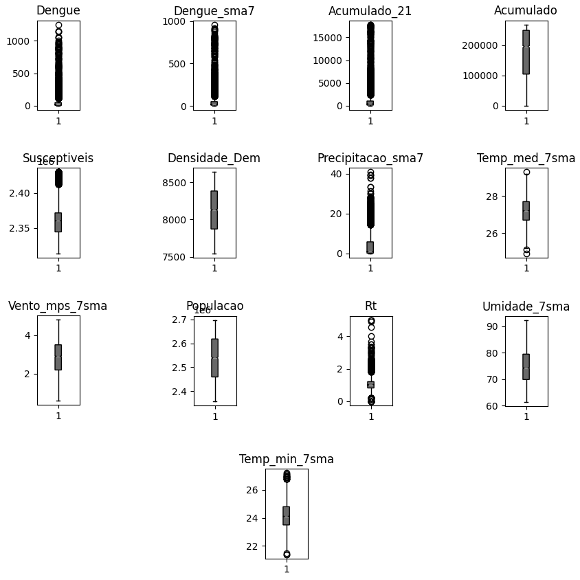

    Os valores discrepantes mostrados na figura são resultado de surtos de dengue ocorridos na cidade
    de Fortaleza, portanto não são outliers. Há um evidente relacionamento entre as variáveis estudadas e o alvo, os surtos
    de dengue são resultado de picos nos valores das variáveis estudadas. Isso fica mais evidente no gráfico de correlacão de variáveis.

#### Correlação para semana 01
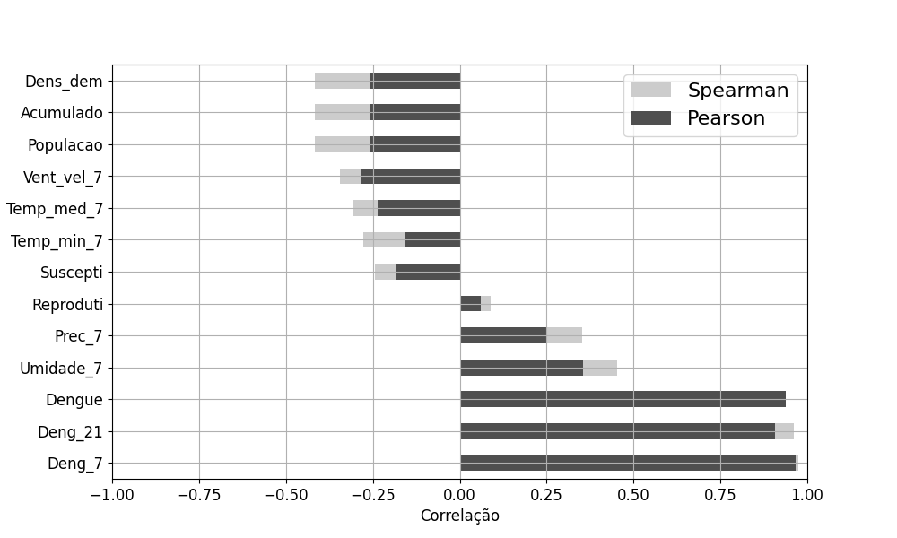
#### Correlação para semana 02
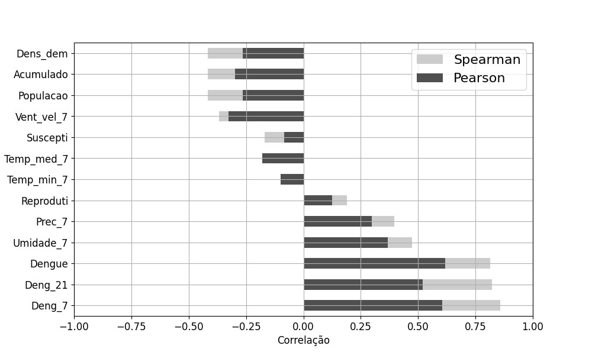
#### Correlação para semana 03
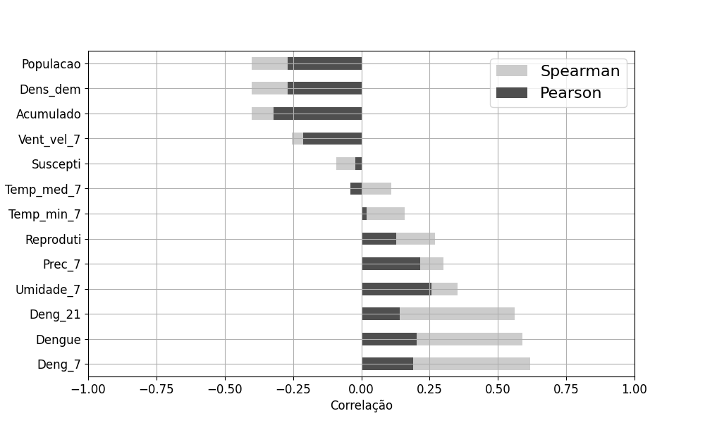
#### Correlação para semana 04
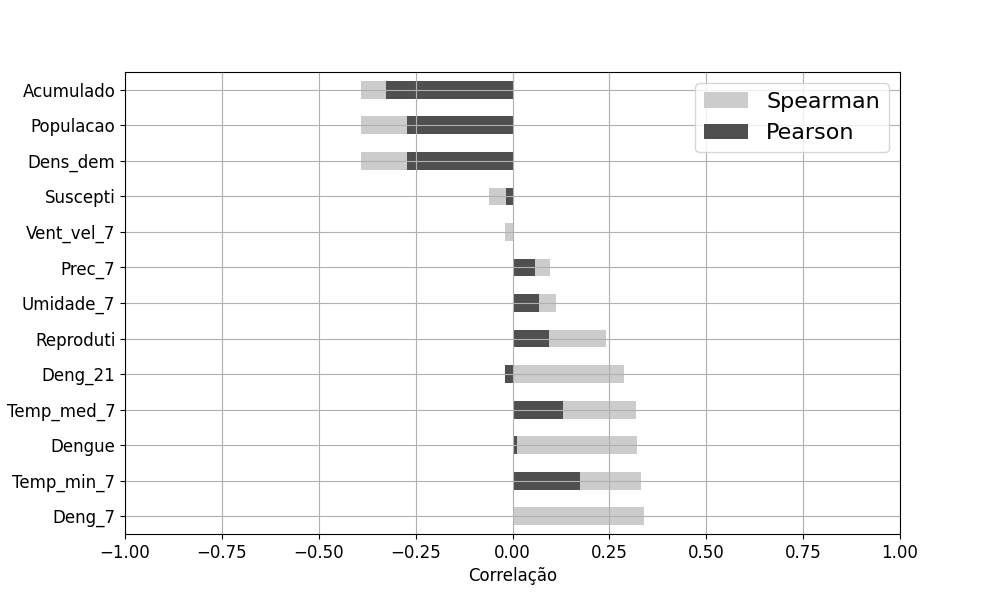

    As figuras a seguir mostram a relação entre os dados de entrada e suas
    relações com 4 alvos: casos de dengue para a 1ª, 5ª, 10ª e 15ª semanas à frente, consecutivamente.
    No estudo de correlações os valores variam de -1 a 1, quanto mais próximo de 1 ou -1 mais forte é a
    relação entre variável e alvo. Os valores com tendência a -1 indicam que os dados têm relação inversamente proporcionais.

    Devido a baixa correlação das variáveis a médida que o número de semanas aumenta, a predição será feita levando
    em consideração a 5ª semana à frente, e variáveis com niveis de correlacão <= -0.30 ou >= 0.30

### Desempenho dos modelos.

#### Modelo KNN
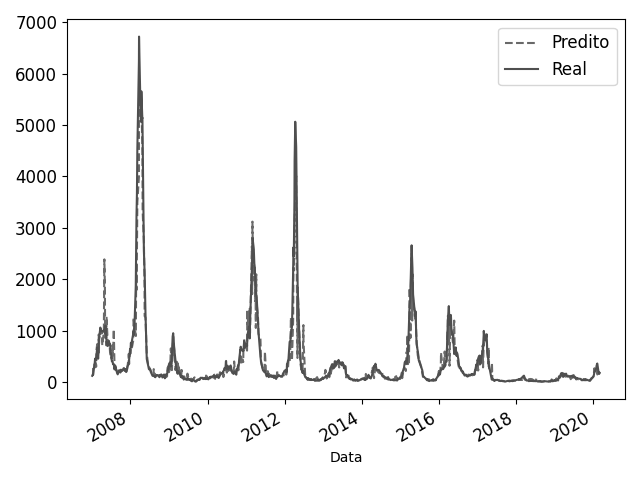
#### Modelo SVR
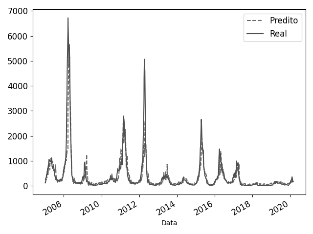
#### Modelo MLP da Literatura
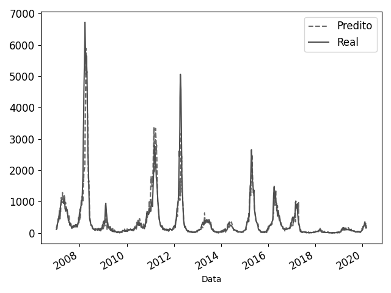
#### Modelo MLP
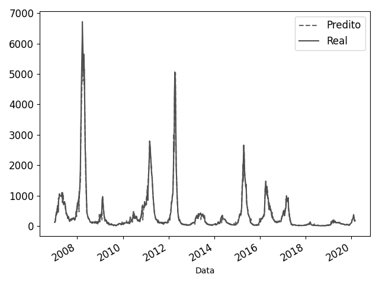
#### Modelo LSTM
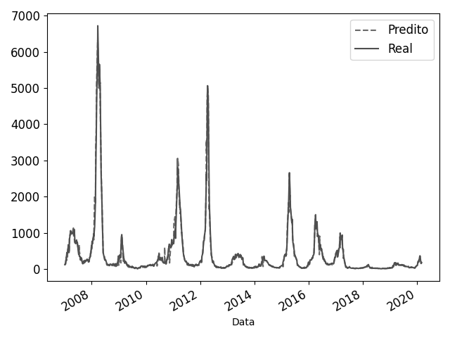
#### Modelo XGBoost
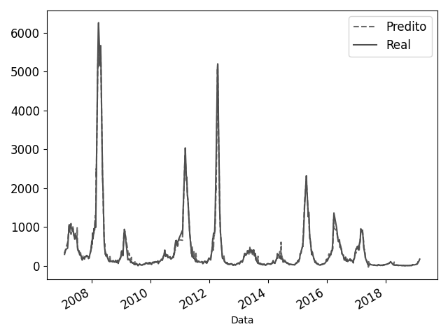

    No eixo X das figuras estão os períodos em anos de casos de dengue estudados, sendo uma amostra com um total de 964 linhas
    distribuídas entre 2007 a 2020. Está amostra trata-se dos dados de teste. O eixo Y representa a quantidade de casos de dengue.

#### Análise Preditiva.

    As métricas utilizadas para avaliação de desempenho dos modelos foram Coeficiente de Determinação R² e Erro Médio Absoluto respectivamente.

Coeficiente R²
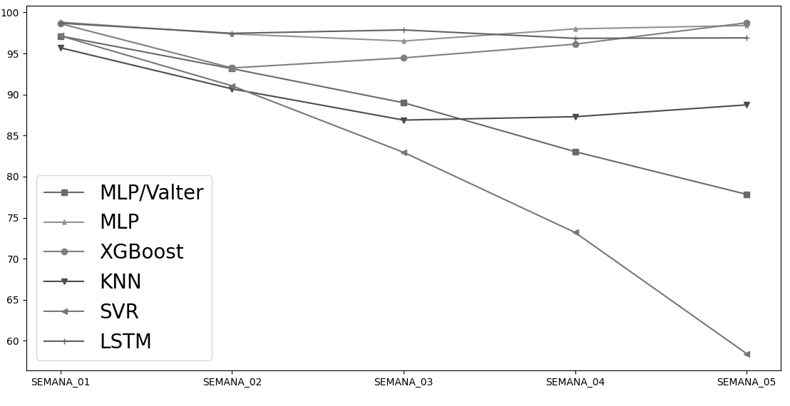
Erro médio Absoluto (MAE)
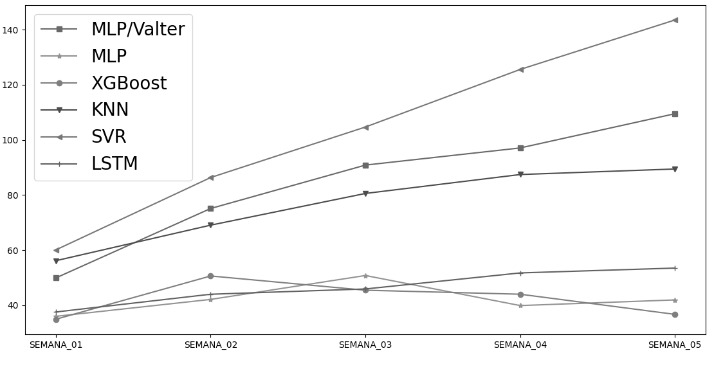

     Tomando como exemplo o modelo que teve o menor erro, o XGBoost, o modelo erra em quantidade de casos de dengue até 36 casos para mais
     e 36 casos para menos em média, levando em consideração o alvo sendo a 5ª semana de casos de dengue no futuro e o MAE.
     A interferência dos valores discrepantes é menor no MAE do que no coeficiente R². O motivo está no o cálculo das métricas utilizadas.
     O R² corresponde ao cálculo da variância, onde as diferenças são elevadas ao quadrado, enquanto o cálculo do MAE resume-se na soma dos módulos das diferenças
     entre valores preditos e valores reais de teste divididos pela quantidade.
